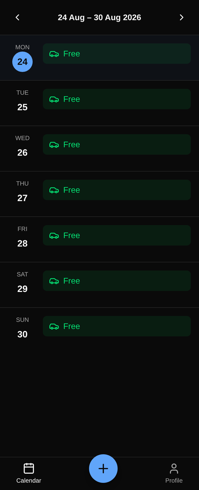
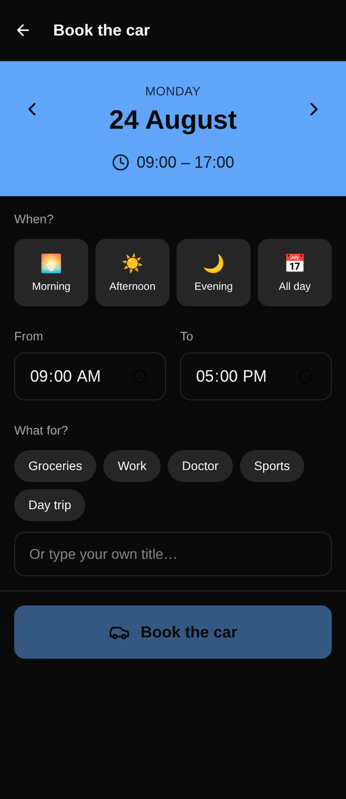
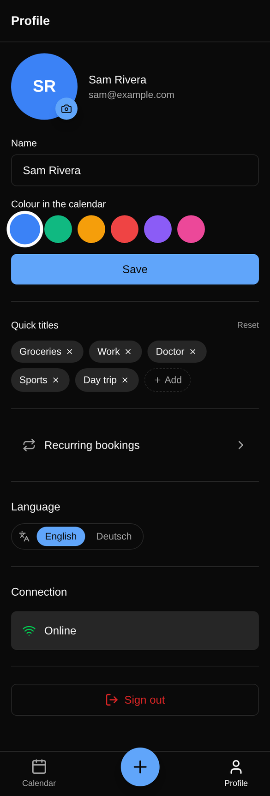
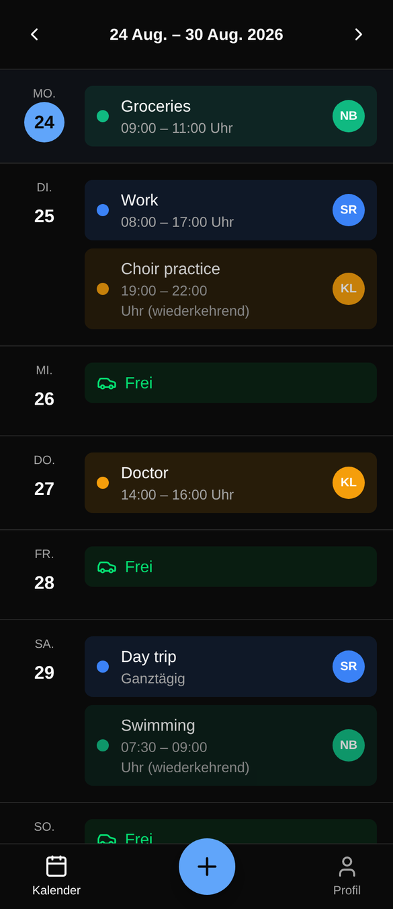
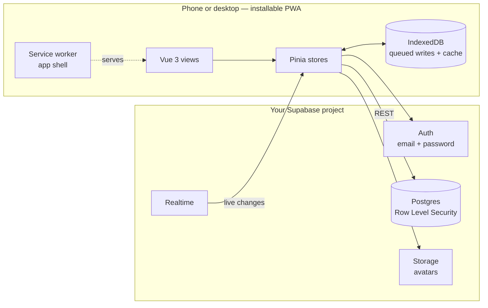

<div align="center">


# Carshare

**A shared calendar for one car and the handful of people who drive it.**

Book the car, see who has it, sync when you get signal again.
Self-hosted on your own Supabase project — installable as an app on any phone.

[](LICENSE)
[](https://vuejs.org)
[](https://supabase.com)
[](#offline-first)

</div>

---

<div align="center">

| | |
|:--:|:--:|
|  |  |
| **The week** — free days in green, one colour per person, recurring entries folded in. | **Booking** — pick a day, a time preset and a reason. Two taps for the common case. |
|  |  |
| **Profile** — your colour, your quick titles, language, and what is still waiting to sync. | **In German** — the interface switches; booking titles stay as people typed them. |

</div>

## Why

One car, three or four drivers, and a group chat full of *"is the car free on
Thursday?"*. A shared Google Calendar sort of works until someone forgets to
check it; a full fleet-management product wants a company and a monthly bill.

Carshare is the small thing in between: a week view where a free day says
**Free** in green, booking takes two taps, and the whole thing lives on
infrastructure you control. It was built for one household and then cleaned up
so anyone can run their own copy.

## Features

- **Week at a glance** — seven rows, colour-coded per person, free days marked.
- **Two-tap booking** — pick a day, hit *Morning / Afternoon / Evening / All
  day*, pick a reason. Custom times if you want them.
- **Quick titles** — your own chips for *Groceries*, *Work*, *Football*,
  whatever you keep booking. Editable, stored per device.
- **Recurring bookings** — daily, weekly or monthly rules with a validity
  window, expanded into the calendar without cluttering the database.
- **Live updates** — someone else's booking appears on your screen within a
  second, no refresh.
- <a id="offline-first"></a>**Offline-first** — the app opens without a
  connection, shows the last known week, and queues bookings made in a dead
  spot until you have signal again.
- **Installable** — a real PWA: add to home screen, own icon, full screen, no
  browser chrome.
- **Two languages** — English and German, switchable in the app; dates,
  weekday names and plurals follow along.
- **Light and dark** — follows the system setting.

## How it works

There is no backend of your own to run. The app is static files; Supabase
provides auth, the database, realtime and file storage.



Two details worth knowing before you deploy:

- **The anon key is public.** It is compiled into the JavaScript bundle, as
  Supabase intends. Your actual access control is the Row Level Security
  policies in [`supabase/schema.sql`](supabase/schema.sql) — everyone signed in
  can *read* every booking (that is the point of a shared calendar), but can
  only edit or delete their own.
- **Recurring bookings are never stored as rows.** A rule like *"every
  Wednesday 19:00–22:00"* is expanded in the browser for the week on screen.
  That keeps the database small, and it is why an individual occurrence cannot
  be edited or cancelled on its own.

## Quick start

You need [Node.js 20.19+](https://nodejs.org) and a free
[Supabase](https://supabase.com) account. Budget about ten minutes.

### 1. Create a Supabase project

In the Supabase dashboard, create a new project and wait for it to finish
provisioning. Note the region — pick one near the people who will use it.

### 2. Set up the database

Open **SQL Editor**, paste the entire contents of
[`supabase/schema.sql`](supabase/schema.sql), and run it. This creates the
tables, the Row Level Security policies, the avatar storage bucket, the
realtime publication and the trigger that gives every new account a profile.

The script is safe to re-run — you will need that after an update.

### 3. Lock down sign-ups

By default anyone who finds your URL can create an account and see your
calendar. Under **Authentication → Sign In / Providers**, turn off
**Allow new users to sign up**, then invite your people from
**Authentication → Users → Invite**.

Alternatively, leave sign-ups on just long enough for everyone to register,
then turn them off.

> [!IMPORTANT]
> Skipping this step leaves your calendar open to anyone with the link. It is
> the one piece of configuration the app cannot do for you.

### 4. Configure and run the app

```bash
git clone https://github.com/izqkk/carsharing.git
cd carsharing
npm install

cp .env.example .env
# fill in VITE_SUPABASE_URL and VITE_SUPABASE_ANON_KEY
# (dashboard → Project Settings → Data API)

npm run dev
```

Open the printed URL, register the first account, and you are in.

### 5. Build and host it

```bash
npm run build     # writes ./dist
```

`dist/` is plain static files. Serve it from anything that can host a folder —
your own nginx, a static-site host, an object bucket behind a CDN. Two
requirements:

- **HTTPS.** Service workers, and therefore installing the app and offline
  mode, only work over a secure origin (`localhost` excepted).
- **Single-page-app fallback.** Unknown paths must serve `index.html`, or
  reloading on `/profile` returns a 404.

<details>
<summary>nginx example</summary>

```nginx
server {
    listen 443 ssl;
    server_name car.example.com;

    root /var/www/carshare/dist;
    index index.html;

    location / {
        try_files $uri $uri/ /index.html;
    }

    # The service worker must never be served stale, or clients get stuck on
    # an old build.
    location = /sw.js {
        add_header Cache-Control "no-cache";
    }
}
```

</details>

> [!NOTE]
> Environment variables are read when you **build**, not when the server
> starts. Change `.env` and you have to run `npm run build` again.

### 6. Install it on your phone

Open the site in the phone's browser and choose *Add to Home Screen*
(iOS: Share → Add to Home Screen; Android: the install prompt or the ⋮ menu).
It then behaves like an app, including offline.

## Configuration

Every setting lives in `.env` and is baked into the build.

| Variable | Required | Default | What it does |
| --- | :---: | --- | --- |
| `VITE_SUPABASE_URL` | ✅ | — | Your project's API URL. |
| `VITE_SUPABASE_ANON_KEY` | ✅ | — | The **anon** (publishable) key. Never the `service_role` key. |
| `VITE_APP_NAME` | | `Carshare` | Name in the tab, the sign-in screen and the installed app. |
| `VITE_APP_DESCRIPTION` | | *see `.env.example`* | Used in the PWA manifest and the meta description. |
| `VITE_DEFAULT_LOCALE` | | browser, then `en` | First-run language: `en` or `de`. Users can switch it themselves. |

> [!CAUTION]
> Anything named `VITE_*` ends up readable in the browser. That is expected for
> the values above. **Never** put a `service_role` key, a database password or
> any other secret in `.env` — there is no such thing as a private `VITE_`
> variable.

Per-user settings — display name, calendar colour, profile picture, quick
titles, language — are changed in the app under **Profile**, not here.

## Updating

```bash
git pull
npm install
npm run build
```

Then re-run [`supabase/schema.sql`](supabase/schema.sql) in the SQL Editor. It
is idempotent, so this only applies what is new.

## Troubleshooting

<details>
<summary><strong>"This app is not configured yet"</strong> on the sign-in screen</summary>

`VITE_SUPABASE_URL` or `VITE_SUPABASE_ANON_KEY` was empty at build time.
Check `.env`, then rebuild — editing `.env` alone changes nothing about an
existing `dist/`.
</details>

<details>
<summary>Sign-up succeeds but the calendar is empty and nobody has a name</summary>

The `on_auth_user_created` trigger did not run, so there is no `profiles` row.
Re-run `supabase/schema.sql`. Accounts created before the trigger existed need
their profile row inserted by hand.
</details>

<details>
<summary>Profile pictures fail to upload</summary>

The `avatars` storage bucket or its policies are missing. Re-run
`supabase/schema.sql`. If your project blocks DDL on the `storage` schema,
create the bucket manually (Dashboard → Storage, name `avatars`, public) and
add the four policies from the *Avatar storage* section of the script.
</details>

<details>
<summary>Other people's bookings only show up after a refresh</summary>

Realtime is not publishing the tables. Re-run `supabase/schema.sql`, then check
Dashboard → Database → Replication.
</details>

<details>
<summary>The app keeps loading an old version after a deploy</summary>

The service worker is serving a cached shell. Make sure `sw.js` is served with
`Cache-Control: no-cache` (see the nginx example above). To recover a single
device: close every tab of the app, then reopen it.
</details>

<details>
<summary>A booking saved offline never arrives</summary>

Queued writes are retried when the browser reports it is back online, and can
be pushed by hand from **Profile → Connection → sync**. A write is only dropped
from the queue once the server accepts it, so nothing is lost silently — but a
write that the server *rejects* (for example a booking whose author was
deleted) will keep retrying.
</details>

## Development

```bash
npm run dev         # dev server with hot reload
npm run typecheck   # vue-tsc, no emit
npm run lint        # ESLint (flat config)
npm test            # Vitest
npm run build       # typecheck + production build
```

All four of the checks above run in CI on every push and pull request.

### Project layout

```
src/
  components/
    calendar/     week grid and its header
    layout/       app shell and bottom navigation
    ui/           avatar, language switcher
  i18n/           translation core + en/de dictionaries
  lib/            supabase client, app config, recurrence expansion, quick titles
  router/         routes and the auth guard
  stores/         pinia: auth, bookings, recurring, offline queue
  types/          shared row types
  views/          one per screen
supabase/
  schema.sql      tables, RLS, storage, realtime, triggers
```

### Translations

English (`src/i18n/dictionaries/en.ts`) is the reference. German declares
itself as the same type, so **a missing or misspelled key is a compile error,
not a string like `profile.signOut` appearing in the UI**. Adding a language
means adding a dictionary file, extending `LOCALES`, and mapping its date-fns
locale — weekday names and plural rules come from `Intl` and need no
translation.

### Tests

`npm test` covers the parts where a mistake is silent rather than loud:
recurrence expansion, translation lookup and pluralisation, and the quick-title
storage round-trip (including corrupt or blocked `localStorage`). Everything
runs in Node with no browser and no database.

## Known limitations

Honest list, so nobody discovers these the hard way:

- **No conflict detection.** Two people can book the same afternoon. The
  calendar shows both; sorting it out is a human problem.
- **No approvals or priorities.** Every booking is equal, and anyone can only
  change their own.
- **Recurring occurrences are all-or-nothing.** You cannot cancel a single
  Wednesday — you edit or deactivate the rule.
- **Bookings do not span midnight.** An entry ending before it starts is
  accepted by the database and will render oddly.
- **No notifications.** No push, no email, no reminders.
- **One car per project.** Two cars means two Supabase projects and two builds.
- **Timestamps are absolute, display is local.** Everyone travelling across
  time zones will see the same instant, not the same wall-clock time.

## Security

- Access control is entirely Row Level Security. If you edit
  `supabase/schema.sql`, keep the "read everything, write only your own" shape
  or you will hand every signed-in user the ability to delete other people's
  bookings.
- Turn off open sign-ups (step 3). This is the single most common way a
  self-hosted instance ends up public.
- Uploaded avatars live in a **public** bucket — the URLs are unguessable but
  not access-controlled. Do not treat them as private photos.
- Found something worse than that? Please report it privately via GitHub's
  *Security → Report a vulnerability* rather than opening a public issue.

## Contributing

Bug reports, translations and pull requests are all welcome — see
[CONTRIBUTING.md](CONTRIBUTING.md). Run `npm run lint`, `npm run typecheck` and
`npm test` before opening one.

## Credits

Built with [Vue 3](https://vuejs.org), [Vite](https://vite.dev),
[Tailwind CSS](https://tailwindcss.com), [Pinia](https://pinia.vuejs.org),
[date-fns](https://date-fns.org), [Lucide](https://lucide.dev),
[vite-plugin-pwa](https://vite-pwa-org.netlify.app) and
[Supabase](https://supabase.com).

## License

[MIT](LICENSE) © izqkk
